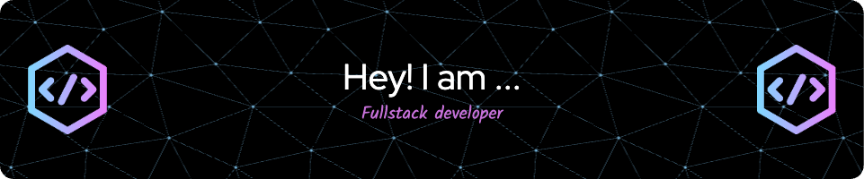

### Hi there 👋

I'm Shruti Mathews from India and I am a software developer. I enjoy the journey of learning new languages and frameworks, reading documents, following tutorials, and working on side projects. You can connect with me on LinkedIn: https://www.linkedin.com/in/shruti-mathews/ and check out my Leetcode profile at https://leetcode.com/u/Shruti2000/

Skills: JS / HTML / CSS / REACTJS / NODEJS / DJANGO / PYTHON / C / JAVA 

- 🔭 I’m currently working on this page. 

      
